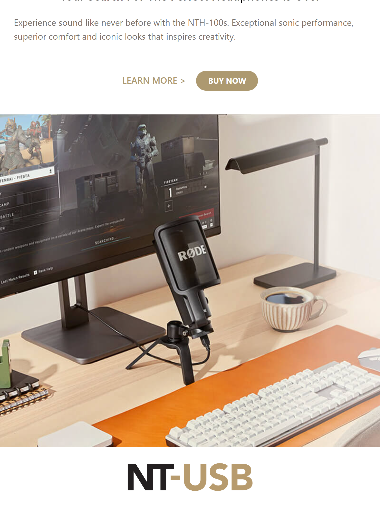
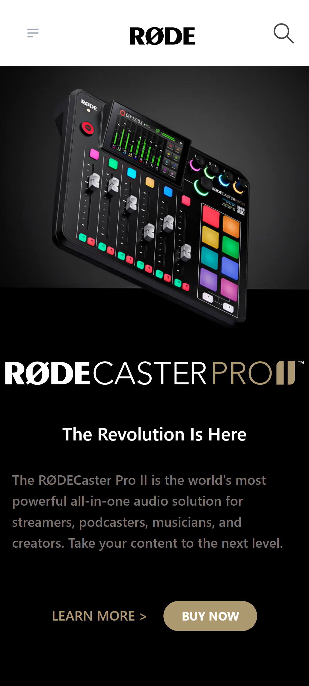

# Rode Landing Page clone  

This is Rode Landing-page clone made using html5 and tailwind css.

## Preview of different screen sizes

1. Desktop size
   

2. tablet size
   

3. mobile size
   

## Author

- [Rakshit Koyani](https://raw.githubusercontent.com/rakshitkoyani/Dancer-portfolio/main/Project-14.png)

  
  
  

## What I have learnt in this project

1. This project helped me to understand different classes and utilities of tailwind css and how to make the responsive ui which works on all types of devices. Also learnt the mobile first approach.

2. learnt to use different tailwind blocks for building website faster.

## Live link of the project

https://Rode-landingpage-clone.netlify.app/
